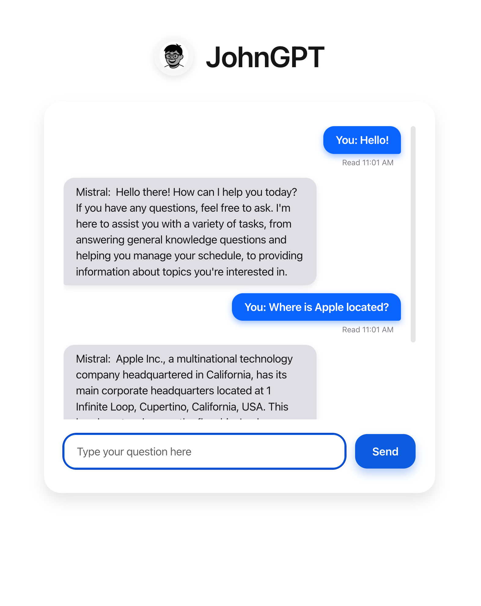

# JohnGPT 🤖

Hey there! This is JohnGPT, a little project I put together because I wanted to create a chatbot that was actually nice to look at and fun to use.

## The Idea

I've always loved the clean look of iMessage and thought it would be a fun challenge to build my very first chatbot. Everything you see, from the chat bubbles to the typing animation, was built from scratch to create something that feels like you're messaging someone from an iPhone! 

## Key Features

* **iMessage-Style UI:** A clean, minimalist interface that should feel instantly familiar.
* **Real-time Typing Indicator:** A sleek animation shows when the bot is preparing a response.
* **"Read" Receipts:** Adds a "Read" receipt with a timestamp under your messages, just like a real chat app.
* **Powered by Ollama:** Connects to a local Ollama instance to generate intelligent and context-aware responses from models like Mistral.
* **Simple & Fast Backend:** Built with FastAPI, ensuring a lightweight and high-performance server.
* **Vanilla Frontend:** No complex frameworks—just good old HTML, CSS, and JavaScript.

## Tech Used

* **Backend:** Python with **FastAPI**
* **AI Model Hosting:** **Ollama**
* **AI Model:** **Mistral**
* **Frontend:** HTML5, CSS3, Vanilla JavaScript

## Future Ideas 
This project was a ton of fun, but there are definitely a few things I'd love to add down the road:

**Markdown Support:** It would be awesome to let the AI respond with formatted text.

**Conversation History:** Right now, my bot has the memory of a goldfish. It would be a game-changer to let it remember the last few messages in a conversation to make the chat feel more natural and context-aware.

**Better Error Handling:** If something breaks when talking to the AI, it would be much nicer to show a friendly "Oops! Something went wrong" message in the chat instead of just failing silently.